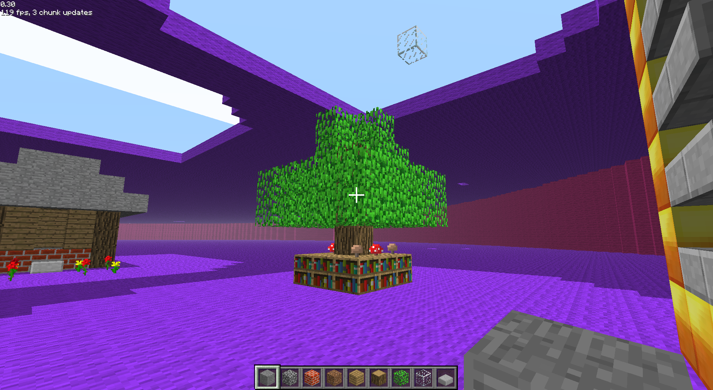

# ltoloxa Server
Library for building Minecraft classic servers

Simplfies creating a Minecraft Classic server by parsing the raw packets, and formatting them into easier to handle data types. Powered by [Bun](https://bun.sh)

`index.ts` is an example of a (basic) server utilizing ltoloxa.




## Usage
```js
import { ClientPacket, CPlayerID, CSetBlock, CMsg, PlayerPos, Player, parseShort, parseString, parseTypes } from 'types.ts';
import { getID, returnServerID, sendWorld,spawnPlayer, spawnPlayer } from 'loginHelpers.ts';
import { broadcast, parseClientData } from 'socketHelpers.ts';
import { lto } from 'index.ts';

lto.on('login', async (packet, socket, data) => {});
lto.on('block', async (packet, socket, data) => {});
lto.on('pos', async (packet, socket, data) => {});
lto.on('chat', async (packet socket, data) => {});
lto.on('disconnect', async (socket) => {});
```


Thanks to [wiki.vg](https://wiki.vg/Classic_Protocol) for providing the minecraft classic protocol.
